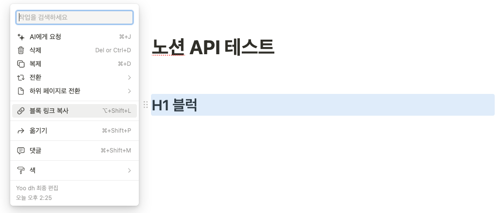
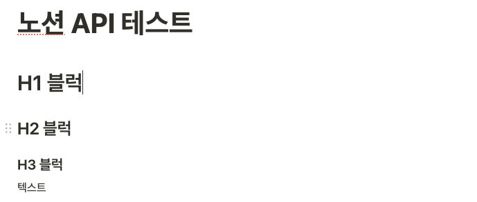

# 노션 블럭 학습  

## 개요

--- 

- 노션의 헤더 블록이 어떻게 구성 되어 있는지 관찰하여, 데이터 구성은 어떻게 되어야 할지 고민 한다.

## 블럭 링크 확인 방법

---



* 블록 옆의 :: 버튼을 클릭 한다.
* 창에서 블록 링크 복사를 클릭한다.

## 블럭의 구조

---

### 예시 블럭

#### 이미지




#### 블럭 구조도 

* [block]
  * [heading_1]
  * [heading_2]
  * [heading_3]
  * [paragraph]

#### 분석

* type 이 block 이면, 이 문서의 최상위 블럭 이다.
* 블럭은 블럭의 타입에 따라서, 블럭의 내용을 가지고 있다.

#### API Json

```json
{
    "object": "list",
    "results": [
        {
            "object": "block",
            "id": "09cf770d-d0de-45cf-9288-aa88d5ece70f",
            "parent": {
                "type": "page_id",
                "page_id": "d54b9f90-3281-4f1b-8073-974c83c966d2"
            },
            "created_time": "2023-12-15T08:53:00.000Z",
            "last_edited_time": "2023-12-15T08:53:00.000Z",
            "created_by": {
                "object": "user",
                "id": "43a6c65c-a9d2-4292-9414-4befaf2122fb"
            },
            "last_edited_by": {
                "object": "user",
                "id": "43a6c65c-a9d2-4292-9414-4befaf2122fb"
            },
            "has_children": false,
            "archived": false,
            "type": "heading_1",
            "heading_1": {
                "rich_text": [
                    {
                        "type": "text",
                        "text": {
                            "content": "테스트으",
                            "link": null
                        },
                        "annotations": {
                            "bold": false,
                            "italic": false,
                            "strikethrough": false,
                            "underline": false,
                            "code": false,
                            "color": "default"
                        },
                        "plain_text": "테스트으",
                        "href": null
                    }
                ],
                "is_toggleable": false,
                "color": "default"
            }
        },
        {
            "object": "block",
            "id": "ab48871a-7d78-4371-a3dc-299d9ad7b876",
            "parent": {
                "type": "page_id",
                "page_id": "d54b9f90-3281-4f1b-8073-974c83c966d2"
            },
            "created_time": "2023-12-20T03:04:00.000Z",
            "last_edited_time": "2023-12-20T03:04:00.000Z",
            "created_by": {
                "object": "user",
                "id": "43a6c65c-a9d2-4292-9414-4befaf2122fb"
            },
            "last_edited_by": {
                "object": "user",
                "id": "43a6c65c-a9d2-4292-9414-4befaf2122fb"
            },
            "has_children": false,
            "archived": false,
            "type": "paragraph",
            "paragraph": {
                "rich_text": [],
                "color": "default"
            }
        }
    ],
    "next_cursor": null,
    "has_more": false,
    "type": "block",
    "block": {},
    "developer_survey": "https://notionup.typeform.com/to/bllBsoI4?utm_source=postman",
    "request_id": "37203f9f-c809-4a59-8aeb-527174bc73ad"
}
```

* type 과, type 을 파라미터로 이름을 가지는(heading_1) 정보가 핵심
* type 은 블럭의 타입을 나타내고, type 을 파라미터로 이름을 가지는 정보는 블럭의 내용을 나타낸다.

#### HTML 분석

```html
<div
        data-block-id="09cf770d-d0de-45cf-9288-aa88d5ece70f"
        class="notion-selectable notion-header-block"
        style="width: 100%; max-width: 152px; margin-top: 2em; margin-bottom: 4px;"
>
    <div style="display: flex; width: 100%; color: inherit; fill: inherit;">
        <h2
                class="notranslate"
                spellcheck="true"
                placeholder="제목1"
                data-content-editable-leaf="true"
                contenteditable="true"
                style='max-width: 100%; width: 100%; white-space: pre-wrap; word-break: break-word; caret-color: rgb(55, 53, 47); padding: 3px 2px; font-family: ui-sans-serif, -apple-system, BlinkMacSystemFont, "Segoe UI", Helvetica, "Apple Color Emoji", Arial, sans-serif, "Segoe UI Emoji", "Segoe UI Symbol"; font-weight: 600; font-size: 1.875em; line-height: 1.3; margin: 0px;'
        >
            H1 블럭
        </h2>
    </div>
</div>;
```

* h1 블록은 html h2 태그로 구성되어 있다.
